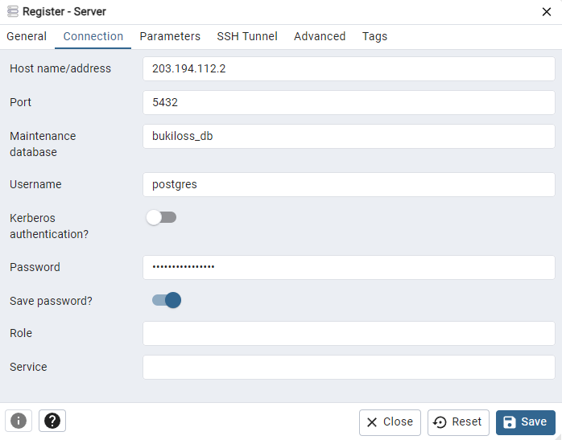

# PENYIAPAN OS

## Cek Versi Ubuntu

``` bash
lsb_release -a
```

``` yaml
No LSB modules are available.
Distributor ID: Ubuntu
Description:    Ubuntu 22.04.1 LTS
Release:        22.04
Codename:       jammy
```

## Firewall

### Cek status UFW
``` bash
sudo ufw status
```

### Izinkan akses SSH
``` bash
sudo ufw allow 22/tcp
```

### Izinkan akses PostgreSQL

``` bash
sudo ufw allow 5432/tcp
```

### Izinkan akses HTTP
``` bash
sudo ufw allow 80/tcp
```

### Izinkan akses HTTPS
``` bash
sudo ufw allow 443/tcp
```

### Izinkan akses ke port 8080
``` bash
sudo ufw allow from any to any port 8080 proto tcp
```

### Izinkan akses ke port 8084
``` bash
sudo ufw allow from any to any port 8084 proto tcp
```

### Aktifkan UFW
``` bash
sudo ufw enable
```

### Periksa kembali firewall
``` bash
sudo ufw status verbose
```

``` yaml
Status: active
Logging: on (low)
Default: deny (incoming), allow (outgoing), disabled (routed)
New profiles: skip

To                         Action      From
--                         ------      ----
22/tcp                     ALLOW IN    Anywhere
5432/tcp                   ALLOW IN    Anywhere
80/tcp                     ALLOW IN    Anywhere
443/tcp                    ALLOW IN    Anywhere
8080/tcp                   ALLOW IN    Anywhere
22/tcp (v6)                ALLOW IN    Anywhere (v6)
5432/tcp (v6)              ALLOW IN    Anywhere (v6)
80/tcp (v6)                ALLOW IN    Anywhere (v6)
443/tcp (v6)               ALLOW IN    Anywhere (v6)
8080/tcp (v6)              ALLOW IN    Anywhere (v6)
```


# PENYIAPAN WEB SERVER

## Instal Java Oracle v17
Tambahkan Repository untuk Java
``` bash
sudo add-apt-repository ppa:linuxuprising/java
```

Apabila muncul pemberitahuan seperti ini, tekan ENTER
``` yaml
Repository: 'deb https://ppa.launchpadcontent.net/linuxuprising/java/ubuntu/ jammy main'
Description:
Oracle Java 11 (LTS) and 17 (LTS) installer for Ubuntu (21.10, 21.04, 20.04, 18.04, 16.04 and 14.04), Pop!_OS, Linux Mint and Debian.

Java binaries are not hosted in this PPA due to licensing. The packages in this PPA download and install Oracle Java, so a working Internet connection is required.

The packages in this PPA are based on the WebUpd8 Oracle Java PPA packages: https://launchpad.net/~webupd8team/+archive/ubuntu/java

Installation instructions (with some tips), feedback, suggestions, bug reports etc.:

Oracle Java 11: https://www.linuxuprising.com/2019/06/new-oracle-java-11-installer-for-ubuntu.html
Oracle Java 17: https://www.linuxuprising.com/2021/09/how-to-install-oracle-java-17-lts-on.html

Important notice regarding Oracle Java 11 and 16: the Oracle JDK license has changed starting April 16, 2019. The new license permits certain uses, such as personal use and development use, at no cost -- but other uses authorized under prior Oracle JDK licenses may no longer be available. A FAQ is available here: https://www.oracle.com/technetwork/java/javase/overview/oracle-jdk-faqs.html . After this change, new Oracle Java 11 releases (11.0.3 and newer) require signing in using an Oracle account to download the binaries. This PPA has a new installer that requires the user to download the Oracle JDK 11 .tar.gz and place it in a folder, and only then install the "oracle-java11-installer-local" package. Details here:  https://www.linuxuprising.com/2019/06/new-oracle-java-11-installer-for-ubuntu.html

For Oracle Java 17, the license has changed, stating that JDK 17 binaries are free to use in production and free to redistribute, at no cost, under the Oracle No-Fee Terms and Conditions License.

About Oracle Java 10, 12, 13, 14, 15 and 16: These versions have reached the end of public updates, therefore they are longer available for download. The Oracle Java 10/12/13/14/15 packages in this PPA no longer worked due to this, so I have removed them. Switch to Oracle Java 17 or OpenJDK 17 instead, which is long term support.

Created for users of https://www.linuxuprising.com/
.
More info: https://launchpad.net/~linuxuprising/+archive/ubuntu/java
Adding repository.
Press [ENTER] to continue or Ctrl-c to cancel.
```

``` bash
sudo apt update
sudo apt install oracle-java17-installer -y 
```

Jika muncul tampilan seperti ini, pilih OK.


Jika muncul tampilan seperti ini, pilih Yes.


``` bash
sudo apt install oracle-java17-set-default -y
```

## Cek Versi Java

``` bash
java -version
```

``` yaml
java version "17.0.6" 2023-01-17 LTS
Java(TM) SE Runtime Environment (build 17.0.6+9-LTS-190)
Java HotSpot(TM) 64-Bit Server VM (build 17.0.6+9-LTS-190, mixed mode, sharing)
```

## Instal Tomcat 9

Periksa ketersediaan package
``` bash
sudo apt-cache search tomcat
```

``` yaml
centreon-plugins - Collection of Nagios plugins to monitor OS, services and network devices
libapache-mod-jk-doc - Documentation of libapache2-mod-jk package
libapache2-mod-jk - Apache 2 connector for the Tomcat Java servlet engine
libjnlp-servlet-java - simple and convenient packaging format for JNLP applications
liblogback-java - flexible logging library for Java
liblogback-java-doc - flexible logging library for Java - documentation
libnetty-tcnative-java - Tomcat native fork for Netty
libnetty-tcnative-jni - Tomcat native fork for Netty (JNI library)
libspring-instrument-java - modular Java/J2EE application framework - Instrumentation
libtcnative-1 - Tomcat native library using the Apache Portable Runtime
libtomcat9-embed-java - Apache Tomcat 9 - Servlet and JSP engine -- embed libraries
libtomcat9-java - Apache Tomcat 9 - Servlet and JSP engine -- core libraries
libtomcatjss-java - JSSE implementation using JSS for Tomcat
monitoring-plugins-contrib - Plugins for nagios compatible monitoring systems
python3-ajpy - Python module to craft AJP requests
resource-agents-extra - Cluster Resource Agents
tomcat-jakartaee-migration - Apache Tomcat migration tool for Jakarta EE
tomcat9 - Apache Tomcat 9 - Servlet and JSP engine
tomcat9-admin - Apache Tomcat 9 - Servlet and JSP engine -- admin web applications
tomcat9-common - Apache Tomcat 9 - Servlet and JSP engine -- common files
tomcat9-docs - Apache Tomcat 9 - Servlet and JSP engine -- documentation
tomcat9-examples - Apache Tomcat 9 - Servlet and JSP engine -- example web applications
tomcat9-user - Apache Tomcat 9 - Servlet and JSP engine -- tools to create user instances
yasat - simple stupid audit tool
```

``` bash
sudo apt install tomcat9 tomcat9-admin -y
```

``` yaml
...
Creating group tomcat with gid 998.
Creating user tomcat (Apache Tomcat) with uid 998 and gid 998.
Creating config file /etc/tomcat9/tomcat-users.xml with new version
Creating config file /etc/tomcat9/web.xml with new version
Creating config file /etc/tomcat9/server.xml with new version
Creating config file /etc/tomcat9/logging.properties with new version
Creating config file /etc/tomcat9/context.xml with new version
Creating config file /etc/tomcat9/catalina.properties with new version
Creating config file /etc/tomcat9/jaspic-providers.xml with new version
Creating config file /etc/logrotate.d/tomcat9 with new version
Creating config file /etc/default/tomcat9 with new version
Created symlink /etc/systemd/system/multi-user.target.wants/tomcat9.service → /lib/systemd/system/tomcat9.service.
...
```


## Cek Versi Tomcat

``` bash
sudo /usr/share/tomcat9/bin/catalina.sh version
```

``` yaml
Using CATALINA_BASE:   /usr/share/tomcat9
Using CATALINA_HOME:   /usr/share/tomcat9
Using CATALINA_TMPDIR: /usr/share/tomcat9/temp
Using JRE_HOME:        /usr
Using CLASSPATH:       /usr/share/tomcat9/bin/bootstrap.jar:/usr/share/tomcat9/bin/tomcat-juli.jar
Using CATALINA_OPTS:
NOTE: Picked up JDK_JAVA_OPTIONS:  --add-opens=java.base/java.lang=ALL-UNNAMED --add-opens=java.base/java.io=ALL-UNNAMED --add-opens=java.base/java.util=ALL-UNNAMED --add-opens=java.base/java.util.concurrent=ALL-UNNAMED --add-opens=java.rmi/sun.rmi.transport=ALL-UNNAMED
Server version: Apache Tomcat/9.0.58 (Ubuntu)
Server built:   Jan 6 1970 15:09:28 UTC
Server number:  9.0.58.0
OS Name:        Linux
OS Version:     5.15.0-46-generic
Architecture:   amd64
JVM Version:    17.0.6+9-LTS-190
JVM Vendor:     Oracle Corporation

```

## Akses Tomcat

Buka Browser, sesuaikan {{IP-ADDRESS}} dengan IP Server.
``` bash
http://{{IP-ADDRESS}}:8080
```

Jika tampil seperti ini maka artinya Tomcat berhasil diinstall:


Sebelum menggunakan manajer aplikasi web Apache Tomcat, siapkan pengguna Tomcat baru.

``` bash
sudo nano /etc/tomcat9/tomcat-users.xml
```

Tambahkan rolename dan akses berikut, sesuaikan {{PASSWORD}} sesuai password tomcat yang hendak dibuat:

``` bash
<role rolename="admin-gui"/>
<role rolename="manager-gui"/>
<user username="tomcat" password="{{PASSWORD}}" roles="admin-gui,manager-gui"/>
```

Tekan Ctrl+O untuk menyimpan, dan tekan Ctrl+X untuk keluar dari Editor Nano.

Restart service tomcat9
```
sudo systemctl restart tomcat9
```

## Akses Tomcat Manager

Buka Browser, sesuaikan {{IP-ADDRESS}} dengan IP Server.
``` bash
http://{{IP-ADDRESS}}:8080/manager/html
```

Saat tampil form login, masukkan Username dan Password yang telah dibuat sebelumnya:


## Nginx

``` bash
sudo apt install nginx -y
sudo systemctl enable nginx
```

``` bash
sudo mkdir -p /var/www/vm-eform.cloud/html
```

``` bash
sudo chown -R $USER:$USER /var/www/vm-eform.cloud/html
```

``` bash
sudo chmod -R 755 /var/www/vm-eform.cloud
```

``` bash
nano /var/www/vm-eform.cloud/html/index.html
```

``` html
<html>
    <head>
        <title>Welcome to vm-eform.cloud!</title>
    </head>
    <body>
        <h1>Success! The vm-eform.cloud server block is working! by AGAM</h1>
    </body>
</html>
```

``` bash
sudo nano /etc/nginx/sites-available/vm-eform.cloud
```

``` bash
server {
        listen 80;
        listen [::]:80;

        root /var/www/vm-eform.cloud/html;
        index index.html index.htm index.nginx-debian.html index.php;

        server_name vm-eform.cloud www.vm-eform.cloud;

        location / {
                try_files $uri $uri/ =404;
        }
}
```

``` bash
sudo ln -s /etc/nginx/sites-available/vm-eform.cloud /etc/nginx/sites-enabled/
```

``` bash
sudo nano /etc/nginx/nginx.conf
```

``` bash
...
http {
    ...
    server_names_hash_bucket_size 64;
    ...
}
...
```

``` bash
sudo nginx -t
```

``` yaml
nginx: the configuration file /etc/nginx/nginx.conf syntax is ok
nginx: configuration file /etc/nginx/nginx.conf test is successful
```

``` bash
sudo systemctl restart nginx
```

``` bash
sudo nano /etc/hosts
```

``` bash
{{IP-SERVER}} vm-eform.cloud www.vm-eform.cloud
```

Coba Akses Domain:


## SSL

```bash
sudo apt install certbot python3-certbot-nginx -y
```

Install Certbot sesuaikan dengan nama domain pada {{NAMA-DOMAIN}}
```bash
sudo certbot --nginx -d {{NAMA-DOMAIN}}
```

* Masukkan E-mail untuk menerima pembaharuan sertifikat.
* Setujui Terms of Service: Y

``` yaml
Saving debug log to /var/log/letsencrypt/letsencrypt.log
Enter email address (used for urgent renewal and security notices)
 (Enter 'c' to cancel): mashum.jabbar@neocomdatasistem.co.id

- - - - - - - - - - - - - - - - - - - - - - - - - - - - - - - - - - - - - - - -
Please read the Terms of Service at
https://letsencrypt.org/documents/LE-SA-v1.4-April-3-2024.pdf. You must agree in
order to register with the ACME server. Do you agree?
- - - - - - - - - - - - - - - - - - - - - - - - - - - - - - - - - - - - - - - -
(Y)es/(N)o: Y

- - - - - - - - - - - - - - - - - - - - - - - - - - - - - - - - - - - - - - - -
Would you be willing, once your first certificate is successfully issued, to
share your email address with the Electronic Frontier Foundation, a founding
partner of the Let's Encrypt project and the non-profit organization that
develops Certbot? We'd like to send you email about our work encrypting the web,
EFF news, campaigns, and ways to support digital freedom.
- - - - - - - - - - - - - - - - - - - - - - - - - - - - - - - - - - - - - - - -
(Y)es/(N)o: Y
Account registered.
Requesting a certificate for vm-eform.cloud

Successfully received certificate.
Certificate is saved at: /etc/letsencrypt/live/vm-eform.cloud/fullchain.pem
Key is saved at:         /etc/letsencrypt/live/vm-eform.cloud/privkey.pem
This certificate expires on 2025-03-17.
These files will be updated when the certificate renews.
Certbot has set up a scheduled task to automatically renew this certificate in the background.

Deploying certificate
Successfully deployed certificate for vm-eform.cloud to /etc/nginx/sites-enabled/vm-eform.cloud
Congratulations! You have successfully enabled HTTPS on https://vm-eform.cloud

- - - - - - - - - - - - - - - - - - - - - - - - - - - - - - - - - - - - - - - -
If you like Certbot, please consider supporting our work by:
 * Donating to ISRG / Let's Encrypt:   https://letsencrypt.org/donate
 * Donating to EFF:                    https://eff.org/donate-le
- - - - - - - - - - - - - - - - - - - - - - - - - - - - - - - - - - - - - - - -
```

Coba akses domain menggunakan SSL, perhatikan bahwa masa berlaku dari SSL Free hanya 3 bulan, dan harus melakukan perpanjangan. Certbot akan secara otomatis menyiapkan pekerjaan cron untuk memperbarui sertifikat Anda saat masa berlakunya hampir habis.


## Konfigurasi Nginx

``` bash
sudo nano /etc/nginx/sites-available/vm-eform.cloud
```

``` bash
server {
    root /var/www/vm-eform.cloud/html;
    index index.html index.htm index.nginx-debian.html index.php;

    server_name vm-eform.cloud www.vm-eform.cloud;

    # Reverse Proxy untuk aplikasi di Tomcat (http://203.194.112.2:8080/eform)
    location /eform {
        proxy_pass http://203.194.112.2:8080/eform;  # Mengarah ke aplikasi di Tomcat
        proxy_set_header Host $host;
        proxy_set_header X-Real-IP $remote_addr;
        proxy_set_header X-Forwarded-For $proxy_add_x_forwarded_for;
        proxy_set_header X-Forwarded-Proto $scheme;
        proxy_redirect off;
    }

    listen [::]:443 ssl ipv6only=on; # managed by Certbot
    listen 443 ssl; # managed by Certbot
    ssl_certificate /etc/letsencrypt/live/vm-eform.cloud/fullchain.pem; # managed by Certbot
    ssl_certificate_key /etc/letsencrypt/live/vm-eform.cloud/privkey.pem; # managed by Certbot
    include /etc/letsencrypt/options-ssl-nginx.conf; # managed by Certbot
    ssl_dhparam /etc/letsencrypt/ssl-dhparams.pem; # managed by Certbot
}

server {
    if ($host = vm-eform.cloud) {
        return 301 https://$host$request_uri;
    } # managed by Certbot

    listen 80;
    listen [::]:80;

    server_name vm-eform.cloud www.vm-eform.cloud;
    return 404; # managed by Certbot
}
```

# PENYIAPAN DATABASE

## Persiapan

Install GNUPG2 dan WGET
``` bash
sudo apt install gnupg2 wget -y
```

Menambahkan Repository
``` bash
sudo sh -c 'echo "deb http://apt.postgresql.org/pub/repos/apt $(lsb_release -cs)-pgdg main" > /etc/apt/sources.list.d/pgdg.list'
```

Import repository signing key
``` bash
curl -fsSL https://www.postgresql.org/media/keys/ACCC4CF8.asc | sudo gpg --dearmor -o /etc/apt/trusted.gpg.d/postgresql.gpg
```

Update Package
``` bash
sudo apt update
```

## Instalasi PostgreSQL 16

``` bash
sudo apt install postgresql-16 postgresql-contrib-16 -y
```

``` bash
sudo systemctl start postgresql
sudo systemctl enable postgresql
```

## Cek Versi PostgreSQL

``` bash
psql --version
```

``` yaml
psql (PostgreSQL) 16.6 (Ubuntu 16.6-1.pgdg22.04+1)
```

## Konfigurasi PostgreSQL
``` bash
sudo nano /etc/postgresql/16/main/postgresql.conf
```

``` yaml
Ubah 
#listen_addresses = 'localhost' 

Menjadi 
listen_addresses = '*'
```

Tekan Ctrl+O untuk menyimpan, dan tekan Ctrl+X untuk keluar dari Editor Nano.

Konfigurasikan PostgreSQL untuk menggunakan otentikasi kata sandi md5 dengan mengedit **pg_hba.conf**. Ini penting jika Anda ingin terhubung secara remote, misalnya melalui PGADMIN.

``` bash
sudo sed -i '/^host/s/ident/md5/' /etc/postgresql/16/main/pg_hba.conf
sudo sed -i '/^local/s/peer/trust/' /etc/postgresql/16/main/pg_hba.conf
echo "host all all 0.0.0.0/0 md5" | sudo tee -a /etc/postgresql/16/main/pg_hba.conf
```

Restart service
``` bash
sudo systemctl restart postgresql
``` 

Masuk ke dalam PostgreSQL
``` bash
sudo -u postgres psql
```

Ubah {{PASSWORD_DB}} sesuai Password untuk untuk user postgres
``` bash
ALTER USER postgres PASSWORD '{{PASSWORD_DB}}';
```

```
sudo nano /etc/postgresql/16/main/pg_hba.conf
```

Ubah method trust atau peer menjadi md5 agar ketika masuk ke PostgreSQL dari Server perlu diminta login
``` yaml
local   all             postgres                                md5
````

Tekan Ctrl+O untuk menyimpan, dan tekan Ctrl+X untuk keluar dari Editor Nano.

```
sudo systemctl restart postgresql
```


## Create DB

``` bash
sudo -u postgres psql -c "CREATE DATABASE bukiloss_db;" -c "GRANT ALL PRIVILEGES ON DATABASE bukiloss_db TO postgres;"
```

## Akses DB PgAdmin

Jika belum punya toolsnya, silahkan download pada Link resmi berikut : https://ftp.postgresql.org/pub/pgadmin/pgadmin4/v8.14/windows/pgadmin4-8.14-x64.exe

1. Klik Object - Register - Server
2. Pada bagian Connection atur sebagai berikut:
* Host: {{IP-ADDRESS}}
* Port: 5432
* Maintenance Database: bukiloss_db
* Username: postgres
* Password: {{PASSWORD_DB}}
* Save Password? Enable (Opsional) 
3. Klik tombol SAVE



Untuk import DB pertama kali dari hasil backup:
1. Klik kanan pada Database
2. Pilih Restore
3. Setelah muncuk dialog Restore, pilih file
4. Role name: postgres
5. Klik tombol Restore


# BUILD

## Persiapan Netbeans

Buka Source Code di Netbeans, jika belum punya, silahkan unduh di : https://archive.apache.org/dist/netbeans/netbeans-installers/23/Apache-NetBeans-23-bin-windows-x64.exe

Cara buka source code : 
1. Klik File
2. Open Project
3. Pilih Project Folder (Source Code)
4. Klik tombol Open Project


Jika menemukan error merah seperti ini, maka kita perlu Unduh :
* https://repo1.maven.org/maven2/javax/servlet/javax.servlet-api/3.0.1/javax.servlet-api-3.0.1.jar
* https://repo1.maven.org/maven2/org/apache/tomcat/tomcat-util/8.5.23/tomcat-util-8.5.23.jar
* https://repo1.maven.org/maven2/javax/xml/bind/jaxb-api/2.1/jaxb-api-2.1.jar
* https://repo1.maven.org/maven2/org/apache/ant/ant/1.10.15/ant-1.10.15.jar

Tambah dengan cara : 
1. Klik kanan pada Libraries
2. Pilih Add JAR/Folder
3. Cari File .jar yang telah diunduh
4. Klik tombol Open


Maka error akan hilang:


## Build

Untuk build file .WAR klik tombol Clean and Build


# REFERENSI
* https://www.digitalocean.com/community/tutorials/how-to-set-up-a-firewall-with-ufw-on-ubuntu
* https://bluevps.com/blog/how-to-install-java-on-ubuntu
* https://medium.com/@madhavarajas1997/installing-apache-tomcat-on-ubuntu-22-04-08c8eda52312
* https://www.digitalocean.com/community/tutorials/how-to-install-nginx-on-ubuntu-22-04
* https://www.kamatera.com/knowledgebase/how-to-secure-nginx-with-lets-encrypt/
* https://dev.to/johndotowl/postgresql-16-installation-on-ubuntu-2204-51ia